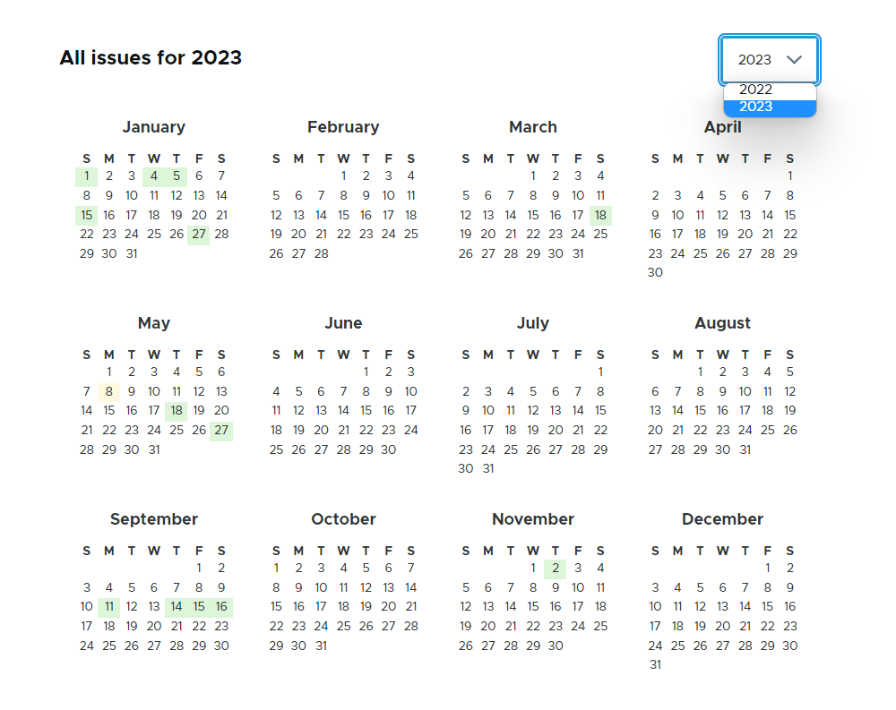

# FullCalendar Solr

FullCalendar Solr provides integration with the JavaScript FullCalendar library
to provide a Year Calendar View display formatter that is compatible with
Search API.

The calendar highlights dates associated with content. It also features a year
dropdown containing only years that have content. This module is compatible
with Search API Solr and Facets modules.

**Note:** this formatter is not compatible with regular content Views.

## Requirements

This module requires the following modules:

- [Search API](https://www.drupal.org/project/search_api)
- [Views](https://www.drupal.org/project/views)

The Search API backend needs to support the `search_api_facets` option.

## Installation

1. Clone this repo into `drupal/web/modules/contrib`.
1. Enable the module at `Admin > Extend`.

## Configuration

1. At `/admin/structure/views`, click `Add view`. Under `View settings > Show`,
select an index.
1. Create a Page. Set the display format to `FullCalendar Solr`.
1. Configure the page path such that the last component is 'year'.
(e.g. `/a/b/c/year`)
1. Under `Fields`, add a string field containing a date in YYYY-MM-DD format. 
Any dates not in YYYY-MM-DD format will not be displayed in the calendar.
1. Under `Advanced > Contextual Filters`, select a field containing year values
in YYYY format.
1. Under `Format > Settings`, configure the date and year fields.
1. Add any additional view configurations as needed.
1. Save the view.

## Redirecting to a Day View

**To enable:** In the view settings, under `Format > Settings`, check the
`Navigation Links to Day View` option. 

If this is enabled, when a user clicks a highlighted date on the calendar,
it will open up a new tab to a day view containing all the search results
for that day. This day view will have to be created separately.

### Creating the Day View

1. Create a view page. (The view should show indexed content)
1. Select a display style. (One that is not FullCalendar Solr)
1. Under `Advanced > Contextual Filter`, add a field containing a string date
in YYYY-MM-DD format. This should be the same as the date field used in the
year view.
1. Configure the page path. The path of this view should be the same as the
path of the year view except the last URL component is 'day' instead of 'year'
(i.e. if the year view has path `/a/b/c/year`, the day view must have path
`/a/b/c/day`).
**Note:** The year and day view should have the same contextual filters.
1. Add any additional view configurations as needed.
1. Save the view.

## Troubleshooting

If the year calendar doesn't display all dates with content, go to
`View settings > Pager options`, and set the `Items per page` option to 365.
